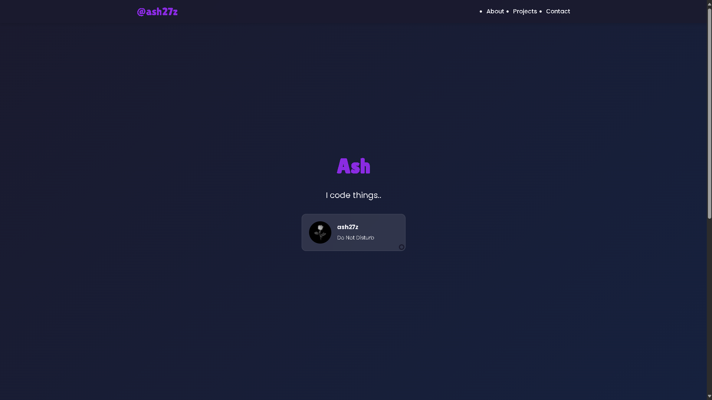

# Simple Portfolio

A minimalist and modern portfolio website template. This portfolio is fully responsive and easy to customize. Feel free to use the source code for your own projects! 
## Features  
- Responsive design (mobile-friendly)  
- GitHub API integration to display repos
- Simple and easy-to-edit HTML, CSS, and JavaScript  

## Portfolio
You can check out where I used the src of the portfolio: [(https://ash27z-production.up.railway.app/)]  

## Installation & Usage  
1. Clone the repository:  
   git clone https://github.com/ash27z/Simple-Portfolio.git  
2. Open index.html in your browser.  
3. Customize the content (name, bio, social links, etc.).  

## Customization  
- Modify the colors in the `:root` section of style.css to match your style.  
- Replace the name and bio in index.html.  
- Add your own GitHub username in script.js to display your repositories dynamically.  

## Contributing  
Feel free to fork the project, submit pull requests, or suggest improvements!  

## License  
This project is open-source and available under the MIT License.  
